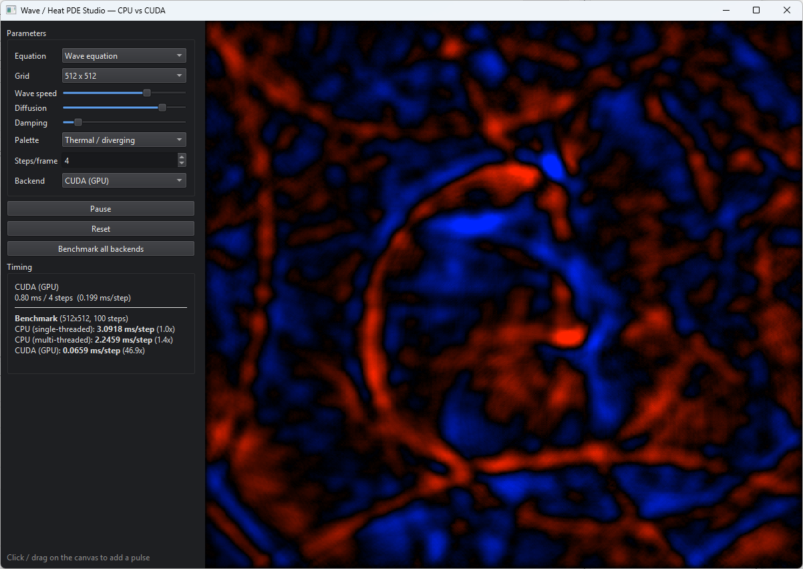

# Wave / Heat PDE Studio — CPU vs CUDA

[](https://github.com/sponsors/makarov-mm)
[](LICENSE)

[](https://www.linkedin.com/in/makarov-mm/)
[](https://www.threads.net/@m.m.makarov)
[](https://www.instagram.com/m.m.makarov/)


A real-time 2D partial-differential-equation simulator built with **Qt 6 (C++17)**.
It solves the **wave equation**, the **heat equation**, and the **Gray–Scott
reaction–diffusion system** on a grid with finite differences, and runs the exact
same simulation on four back-ends so you can compare their performance live:

- **CPU (single-threaded)** — a straightforward baseline
- **CPU (multi-threaded)** — the same stencil parallelized across rows with a persistent thread pool
- **CUDA (GPU)** — one thread per grid cell, global-memory reads
- **CUDA (GPU, tiled)** — one thread per cell, but each block first stages an
  18×18 tile (16×16 plus a one-cell halo) into shared memory, then computes the
  Laplacian from the tile

All back-ends share the identical stencil math and the identical coloring
(`Stencil.h`), so their output is **pixel-for-pixel identical** — what you compare
is speed.



## What it demonstrates

This is a **stencil / finite-difference time-stepping** workload — a different
parallel pattern from an embarrassingly-parallel fractal or an all-pairs N-body
simulation. Each cell is updated from its four neighbors every step, the state
is carried between steps, and the memory-access pattern (each value read by five
threads) is exactly the case shared-memory tiling was designed for.

### Equations

- **Wave equation** `u_tt = c² ∇²u` — leapfrog scheme (keeps the previous
  field), adjustable speed and damping. Click to drop a pulse and watch ripples
  radiate, reflect, and diffract.
- **Heat equation** `u_t = α ∇²u` — explicit forward Euler; paint heat onto the
  grid and watch it diffuse.
- **Gray–Scott reaction–diffusion** — two coupled fields *u*, *v* with
  `u_t = Dᵤ∇²u − uv² + F(1−u)` and `v_t 	= Dᵥ∇²v + uv² − (F+k)v`.
  Depending on the feed/kill rates it self-organizes into corals, spots,
  worms, dividing cells, or chaos. Preset patterns included
  (**Coral, Mitosis, Worms, Spots, Chaos**) plus free Feed/Kill sliders.

### Boundary conditions

Selectable per run, implemented once in `Stencil.h` and used by both CPU and
CUDA paths:

- **Dirichlet** (fixed edges — waves reflect with inversion)
- **Neumann** (reflective — zero normal derivative, waves reflect without inversion)
- **Periodic** (torus — waves leaving on one side re-enter on the other)

### Obstacles and scenes

Any cell can be marked as a **wall**: walls are pinned to the rest value each
step, so waves reflect off them and Gray–Scott patterns grow around them.
Paint walls with the **right mouse button**, erase with **Shift + right button**.

Built-in scenes rebuild the wall mask on demand:

- **Double slit** — a wall with two gaps; drop a pulse behind it and watch the
  classic interference pattern form
- **Ring cavity** — a circular resonator with a small opening
- **Pillar lattice** — an 8×8 array of circular pillars (a crude photonic crystal)

### Rendering

Five palettes: **Thermal (diverging)**, **Ocean (diverging)**, **Mono**,
**Viridis**, and **Magma** — the last two are piecewise-linear LUT
approximations of the matplotlib colormaps. The current frame can be saved with
**Export PNG**.

## The four back-ends

| Backend | Idea |
|---|---|
| CPU (single) | Plain double loop over rows/columns |
| CPU (multi) | Rows split into chunks, distributed over a **persistent thread pool** (workers park on a condition variable between substeps — no thread creation per step) |
| CUDA (naive) | One thread per cell, neighbors read from global memory |
| CUDA (tiled) | Each 16×16 block stages an 18×18 tile into `__shared__` memory, halo included, then computes from the tile — each global value is loaded once per block instead of up to five times |

The **Benchmark all back-ends** button runs 100 identical steps on each and
reports ms/step and the speed-up factor. The live timing panel additionally
shows an exponential moving average and throughput in **Mcells/s**.

Because the operand order in the tiled kernels matches the naive kernels
exactly, all four back-ends stay bit-identical.

## Controls

| Action | Input |
|---|---|
| Inject pulse / heat / chemical | Left mouse drag |
| Paint wall | Right mouse drag |
| Erase wall | Shift + right mouse drag |
| Pause / resume | `Space` |
| Reset | `R` |
| Brush size / power | Sliders in the panel |

## Building

Requirements: **CMake ≥ 3.21**, **Qt 6** (Widgets), a C++17 compiler, and
optionally the **CUDA toolkit** (12.x recommended).

```bash
# with CUDA (set your GPU architecture; 89 = Ada / RTX 40xx)
cmake -B build -DCMAKE_BUILD_TYPE=Release -DUSE_CUDA=ON -DCUDA_ARCH=89
cmake --build build --config Release

# CPU-only (no CUDA toolkit needed; the two CUDA back-ends are hidden)
cmake -B build -DCMAKE_BUILD_TYPE=Release -DUSE_CUDA=OFF
cmake --build build --config Release
```

On Windows with Visual Studio, `generate_vs_solution.bat` /
`generate_vs_solution_cpu.bat` generate a solution (edit the Qt path inside if
needed).

## Project layout

```
src/
  Types.h        — SimParams, enums (equation, backend, boundary, scene, palette)
  Stencil.h      — shared stencil math + coloring; compiled as C++ AND as CUDA device code
  Simulator.h/.cpp — grid state, wall mask, scenes, CPU back-ends, thread pool
  CudaWave.h/.cu — CUDA back-ends (naive + shared-memory tiled), buffer/mask caching
  MainWindow.*   — UI, benchmark, presets, export
  SimWidget.*    — canvas, mouse painting
  main.cpp
```

## Notes on correctness

A headless test drives all 3 equations × 3 boundary conditions × 4 scenes with
an injected pulse and a painted wall, and asserts that the single-threaded and
multi-threaded CPU back-ends produce **bit-identical** images in every
combination, and that save/restore of the field round-trips exactly.

## License

MIT License

Copyright (c) 2026 Mykhailo Makarov

Permission is hereby granted, free of charge, to any person obtaining a copy
of this software and associated documentation files (the "Software"), to deal
in the Software without restriction, including without limitation the rights
to use, copy, modify, merge, publish, distribute, sublicense, and/or sell
copies of the Software, and to permit persons to whom the Software is
furnished to do so, subject to the following conditions:

The above copyright notice and this permission notice shall be included in all
copies or substantial portions of the Software.

THE SOFTWARE IS PROVIDED "AS IS", WITHOUT WARRANTY OF ANY KIND, EXPRESS OR
IMPLIED, INCLUDING BUT NOT LIMITED TO THE WARRANTIES OF MERCHANTABILITY,
FITNESS FOR A PARTICULAR PURPOSE AND NONINFRINGEMENT. IN NO EVENT SHALL THE
AUTHORS OR COPYRIGHT HOLDERS BE LIABLE FOR ANY CLAIM, DAMAGES OR OTHER
LIABILITY, WHETHER IN AN ACTION OF CONTRACT, TORT OR OTHERWISE, ARISING FROM,
OUT OF OR IN CONNECTION WITH THE SOFTWARE OR THE USE OR OTHER DEALINGS IN THE
SOFTWARE.

## Support

If you found this project interesting or useful, you can support my work:

[](https://github.com/sponsors/makarov-mm)

